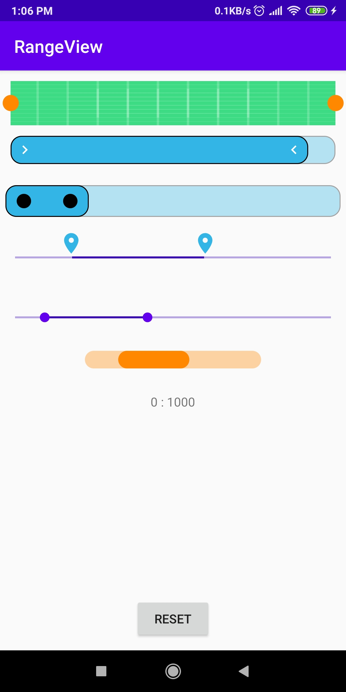

# RangeSeekBarView for Android
> Customizable Linear sliding range selector


RangeSeekBarView is written in Java library. Customizable. Allows to use your vector-drawable as a thumb for seekbar, and use
your created shape drawable as a drawable. Currently RangeView is only linear(timeline), should be more customiazble in future.
<p align="center">

</p>

## Installation

```sh
implementation ....
```

## Usage example

```sh
<com.android.rangeview.RangeSeekBarView
        android:layout_width="wrap_content"
        android:layout_height="36dp"
        android:paddingLeft="6dp"
        android:paddingRight="6dp"
        app:show_trace="true"
        app:background="@drawable/background_1"
        app:thumbGravity="right|center"
        app:thumb_padding="12dp"
        app:thumb_size="18dp"
        app:thumbSrc="@drawable/ic_circle"
        app:srcTint="@android:color/holo_blue_light"
        />
```

## Release History

* 0.0.1
    * First release

<!---
## Contributing

1. Fork it (<https://github.com/yourname/yourproject/fork>)
2. Create your feature branch (`git checkout -b feature/fooBar`)
3. Commit your changes (`git commit -am 'Add some fooBar'`)
4. Push to the branch (`git push origin feature/fooBar`)
5. Create a new Pull Request

<!-- Markdown link & img dfn's -->
[npm-image]: https://img.shields.io/npm/v/datadog-metrics.svg?style=flat-square
[npm-url]: https://npmjs.org/package/datadog-metrics
[npm-downloads]: https://img.shields.io/npm/dm/datadog-metrics.svg?style=flat-square
[travis-image]: https://img.shields.io/travis/dbader/node-datadog-metrics/master.svg?style=flat-square
[travis-url]: https://travis-ci.org/dbader/node-datadog-metrics
[wiki]: https://github.com/yourname/yourproject/wiki
